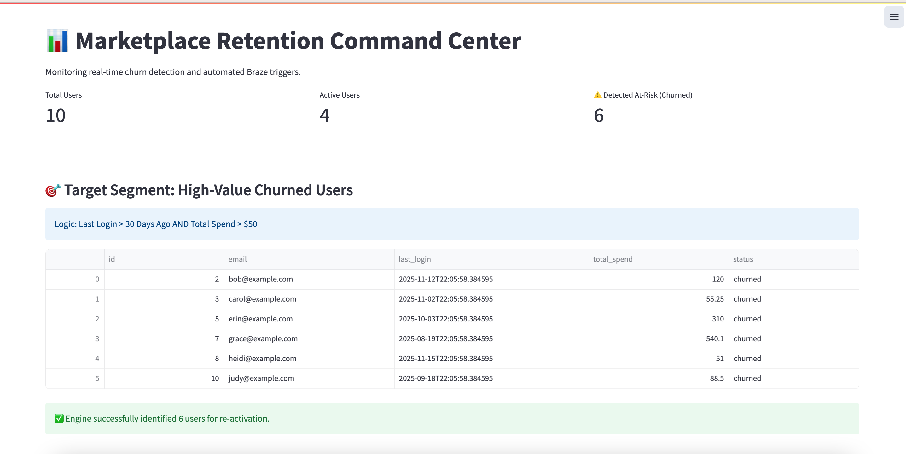

# 🚀 Marketplace Retention Engine & Dashboard

> **A Full-Stack Marketing Automation Prototype**
> Bridging the gap between **SQL Data Engineering** and **Lifecycle Marketing Strategy**.

This project demonstrates a production-ready logic for automating user retention in a marketplace environment (similar to eBay, Finn.no, or Uber). It consists of a backend engine that detects at-risk users via behavioral data and a frontend dashboard for marketing managers to monitor the health of the customer base.



---

## 🎯 Business Value & Logic
In high-volume marketplaces, retaining high-LTV (Lifetime Value) users is critical. This engine automates the recovery process:

1.  **Behavioral Segmentation (SQL):** Identifies users who haven't logged in for **30+ days** (Recency Risk) but have a high total spend (High Value).
2.  **Automated Action (API Trigger):** Instead of manual CSV exports, the system triggers a real-time API call to a Marketing Platform (simulating **Braze**) to start a "Re-activation Journey".
3.  **Operational Visibility (Dashboard):** Provides a visual interface for stakeholders to view churn metrics in real-time.

---

## 🏗 System Architecture

The solution follows an **ETL (Extract, Transform, Load)** pattern combined with a UI layer:

```mermaid
graph LR
    A[(SQLite DB)] -->|Raw Data| B(Churn Logic SQL)
    B -->|Segmented Users| C{Python Orchestrator}
    C -->|Trigger API| D[Braze / CRM Simulator]
    C -->|Visuals| E[Streamlit Dashboard]

Key Components:
main.py (The Engine): Runs the nightly batch job, executes the SQL analysis, and syncs data with the external API.
dashboard.py (The UI): A React-style interactive dashboard built with Streamlit for monitoring user status and logs.
sql/churn_analysis.sql: Complex queries filtering for specific user behaviors (Churn Risk + High LTV).
connectors/braze_client.py: A modular API client mocking the POST requests to an external automation provider.

## 🛠 Tech Stack
Core Logic: Python 3.9+
Data Engineering: SQL (SQLite), Pandas
Visualization: Streamlit
API Integration: RESTful Requests (Mocked)
Environment: Dotenv for secure key management

## 🚀 How to Run
1. Install Dependencies

Bash


python3 -m pip install -r requirements.txt


2. Run the Backend Engine
Execute the automation script to seed the database and trigger the campaigns:

Bash


python3 main.py


Output: You will see terminal logs indicating database seeding, SQL execution, and API trigger simulations.
3. Launch the Manager Dashboard
View the live data and segmentation results:

Bash


python3 -m streamlit run dashboard.py


Output: This will open a local web interface showing real-time churn metrics.

## 📸 Project Highlights
Automated Data Flow: Zero manual intervention required to move users from "At Risk" to "Campaign Enrolled".
Scalable Architecture: Designed to handle millions of rows by leveraging SQL for heavy lifting before loading into Python.
Full-Stack Implementation: Covers the entire loop from Database Schema -> Backend Logic -> Frontend Visualization.

Developed by Naser Rahmani .
